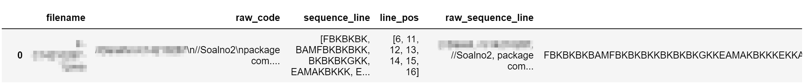
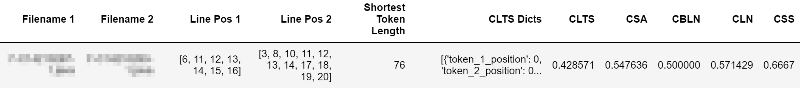

# Java Features
This module will construct java code similarity calculation between two pair of file

# Installation
### Using PIP via PyPI
```
pip install java-features
```
### Using PIP via Github
```
pip install git+https://github.com/tomytw/java-features.git@0.0.1
```

# Usage

## Importing the package
```
from java_features.utilities.main_utility import get_all_filepaths, generate_init_data
from java_features.utilities.stats_scoring_utility import (
    initialize_stats_config, initialize_tokens_percentile, build_token_stats_features,              initialize_features_percentile, build_main_style_stats_features
)
from java_features.FeaturesCalculation import initialize_config, build_style_sequence, create_features_result_df
```
1. Main Utility will be used as initializer for the filepaths of the codes and generate the initial data for the dataframe
    

2. Stats scoring utility will be used to calculate with features related to percentile stats

3. FeaturesCalculation module will be used to calculate the main features and combine all the features
    

    Columns Explanation:
    - Line Pos 1 and Line Pos 2 will be used with CLTS dicts to locate the actual position of segments of codes that are duplicated
    - Starting from CLTS or column number 7 (index 6) are the features that will be used by any model to predict plagiarism 

## Boilerplate code to generate feature pairs between all files in a directory
```
# imports
from java_features.utilities.main_utility import get_all_filepaths, generate_init_data
from java_features.utilities.stats_scoring_utility import (
    initialize_stats_config, initialize_tokens_percentile, build_token_stats_features, initialize_features_percentile, build_main_style_stats_features
)
from java_features.FeaturesCalculation import initialize_config, build_style_sequence, create_features_result_df
import pandas as pd

# initialize config (to determine the list of feature names that will be used)
# initialize config can receive an ini file filepath, please look at plag-configs-example.ini for an example
(PERCENTILES_DEFINE_TOKEN, ADD_PERCENTILE_FEATURE_COLS,
 PERCENTILES_DEFINE_FEATURE, USED_MAIN_FEATURES) = initialize_config()
initialize_stats_config(PERCENTILES_DEFINE_TOKEN, ADD_PERCENTILE_FEATURE_COLS, PERCENTILES_DEFINE_FEATURE, USED_MAIN_FEATURES)

# replace with your directory that contains codes, make sure all of them have unique file names
DIR = '{YOUR_DIRECTORY_NAME}'

# nerf feature (to minimize the false positive generated due to code that contains only skeleton code)
NERF_FEATURES = False
MINIMAL_PAIR_HAVE_SAME_SEGMENT = 0.25

# initialization of the dataframe
filepaths = get_all_filepaths(DIR)
all_data = generate_init_data(filepaths)
columns = ['filename', 'raw_code', 'sequence_line', 'line_pos', 'raw_sequence_line', 'sequence', 'line_len']
initial_codes_df = pd.DataFrame(all_data, columns=columns)
initial_codes_df = initial_codes_df.sort_values(by=['line_len']).reset_index(drop=True)

# start to calculate features
main_codes_df = initial_codes_df.copy(deep=True)
build_style_sequence(main_codes_df)
result_scoring_df = create_features_result_df(main_codes_df, same_segment_nerf=NERF_FEATURES, minimal_pair_have_same_segment=MINIMAL_PAIR_HAVE_SAME_SEGMENT)
main_codes_df['sequence_len'] = main_codes_df['sequence'].str.len()
initialize_tokens_percentile(main_codes_df)
build_token_stats_features(result_scoring_df, main_codes_df)
initialize_features_percentile(result_scoring_df)
build_main_style_stats_features(result_scoring_df)

# output the result to csv file
result_scoring_df.to_csv('features-output.csv', index=False)

```